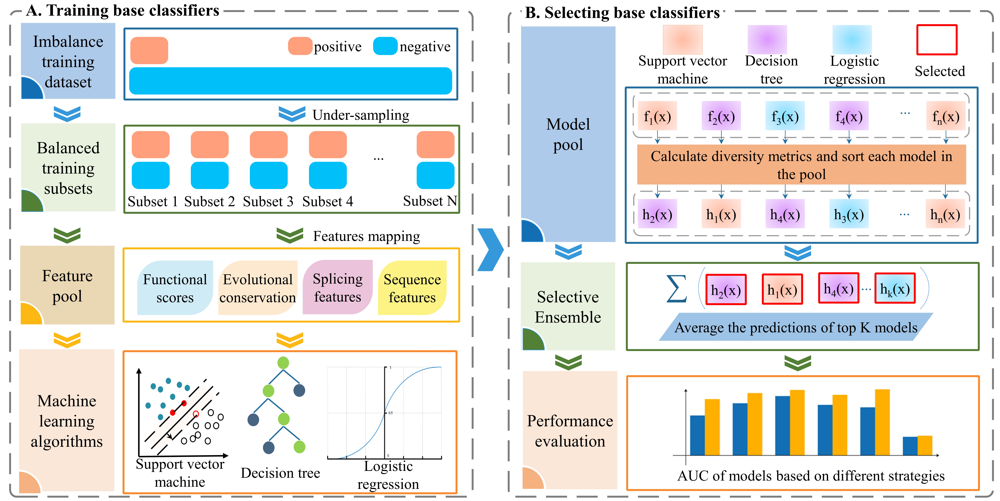

# seDSM
seDSM is a model for the prediction of deleterious synonymous mutations based on selective ensemble scheme.


Figure 1. Experimental flowchart. (A) Base classifiers training. Generate multiple balanced training subsets from the imbalanced benchmark training sets based on random under-sampling methods and then use the balanced training subsets to construct base classifiers with random features selection. There are three different machine learning algorithms, support vector machine, decision tree, and logistic regression, used in this process. (B) Models selection. Calculate diversity measure of each model in the models pool and select the models with better diversity measure for integrating. And finally evaluate the models on the validation data.


<br />

# Abstract

Although previous studies have suggested that synonymous mutations drive or participate in various complex human
diseases, accurately identifying deleterious synonymous mutations from benign ones is still challenging in medical genomics. There are several computational tools that were developed to predict the harmfulness of synonymous
mutations currently. However, most of these computational tools were built based on a balanced training sets ignoring abundant negative samples that may lead to deficient performance. In this study, we proposed a novel model
to predict deleterious synonymous mutations named seDSM, which made full use of the abundant negative samples
through selective ensemble scheme based on pairwise diversity. First of all, we built models pool containing large
number of candidate classifiers for ensemble based on balanced training subsets that were randomly sampled from the
imbalanced training sets. Second, we selected a number of base classifiers from models pool based on pairwise
diversity measures and integrated the models by soft voting. Finally, we constructed seDSM and compared the performance
with other tools. On the independent test sets, seDSM surpasses other state-of-the-art tools on multiple evaluation
indicators, suggesting its outstanding predictive performance for deleterious synonymous mutations. We hope
that our model could contribute to the further study of deleterious synonymous mutations prediction.


# Installation
* Install Python 3.9 in Linux or Windows. Because the program is written in Python 3.9, Python 3.9 with the pip tool must be installed first. 
* seDSM uses the following dependencies: numpy, pandas, sklearn, and DESlib. You can install these packages by the following commands:
```
pip install numpy
pip install pandas
pip install sklearn
pip install deslib
```


# Running seDSM
open cmd in Windows or terminal in Linux, then cd to the `seDSM-master/`folder which contains prediction.py 

The pretrained models can be downloaded with link (URL: https://pan.baidu.com/s/1l-BZVvX6wsS1OaGisIPnZg, Extraction Code: th7v). 

To predict synonymous mutations using our model, run: 

`python prediction.py --csv [custom predicting data in csv format]  --output_dir  [ predicting results in csv format]`


**Example:**
`python prediction.py  --csv ./example/example.csv --output_dir ./results/results.csv`

After running the command, you will obtain the results.csv file that stores the  results predicted.

